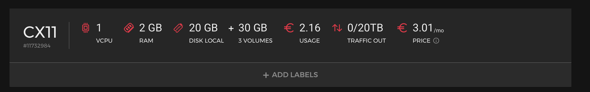

# Index

Nimbus is a VPS, hosted on [Hetzner](https://hetzner.com/). It's the cheapest VPS they offer with a single CPU core, 2Gb of RAM and 20Gb of SSD. I added two 10Gb volumes for my ZFS pool.

I went with a VPS over a true selfhosted solution for the better availability. More and more people around me depend on my services so I need some reliability.

It runs ubuntu server and docker for the few services on there.

It's named Nimbus because it's in the cloud.
