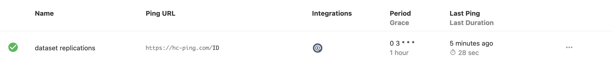

# ZFS
## What is ZFS ?
TODO

## Sanoid

[Sanoid](https://github.com/jimsalterjrs/sanoid/) is a tool to autmate snapshot on ZFS. I also use syncoid to upload some of my snapshots to `extra` as a quick backup.

Sanoid is the only service not (yet) running from a docker container. I just install it on my main system.

### Install

```
apt install git debhelper dpkg-dev build-essential
cd /tmp
git clone https://github.com/jimsalterjrs/sanoid.git
cd sanoid
git checkout $(git tag | grep "^v" | tail -n 1)
ln -s packages/debian .
dpkg-buildpackage -uc -us
apt install ../sanoid_*_all.deb
```

### Config
TODO update this
```
[HDD1/Documents]
	use_template = production
        recursive = yes
[rpool/configs]
	use_template = production
        recursive = yes
[HDD1/Backups]
	use_template = production
        recursive = yes
[HDD1/Media]
        use_template = media
        recursive = yes
[extra/Documents]
        use_template = backup
        recursive = yes
[extra/Backups]
        use_template = backup
        recursive = yes
[extra/configs]
        use_template = backup
        recursive = yes

#############################
# templates below this line #
#############################

[template_production]
	frequently = 4
	hourly = 24
	daily = 7
	monthly = 1
	yearly = 0
	autosnap = yes
	autoprune = yes

[template_media]
	frequently = 0
	hourly = 24
	daily = 7
	monthly = 0
	yearly = 0
	autosnap = yes
	autoprune = yes

[template_backup]
	autoprune = yes
	frequently = 0
	hourly = 0
	daily = 90
	monthly = 0
	yearly = 0

	### don't take new snapshots - snapshots on backup
	### datasets are replicated in from source, not
	### generated locally
	autosnap = no

	### monitor hourlies and dailies, but don't warn or
	### crit until they're over 48h old, since replication
	### is typically daily only
	hourly_warn = 2880
	hourly_crit = 3600
	daily_warn = 48
	daily_crit = 60

[template_ignore]
	autosnap = no
	autoprune = no
	monitor = no
```

I don't want to keep old snapshot of media content, it's only there as a security. That's why I remove snapshots older than a week.

As for the other content I keep snapshots up to a month for the moment.

To enable sanoid I simply run:

```
systemctl enable sanoid.timer
systemctl start sanoid.timer
```

### Syncoid

Syncoid is a tool that comes with sanoid to automate zfs `send` and `recv`. I only backup important data and my configs. I don't feel the need to backup my movies because it would simply cost too much.

```
curl https://hc-ping.com/ID/start
status=0
/usr/sbin/syncoid -r --quiet --no-sync-snap rpool/configs extra/configs || status=1
/usr/sbin/syncoid -r --quiet --no-sync-snap HDD1/Documents extra/Documents || status=1
/usr/sbin/syncoid -r --quiet --no-sync-snap HDD1/Backups extra/Backups  || status=1

if [[ ${status} -eq 1 ]]
then
	curl https://hc-ping.com/ID/fail
else
	curl https://hc-ping.com/ID
fi
```

I run the replication every day at 3AM with this script.

Using [healthcheck.io](healthcheck.io) I am alerted if the replication did not happened or went wrong.



```
0 3 * * * /root/replication
```
