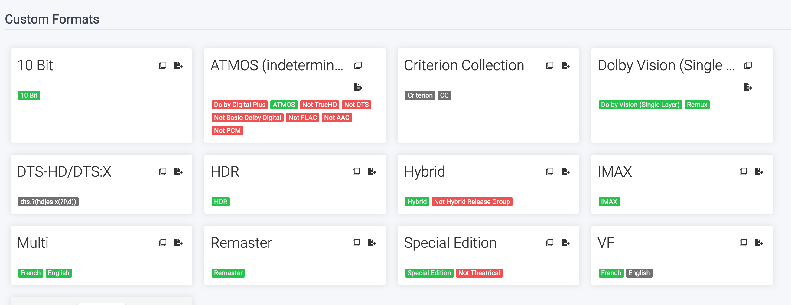
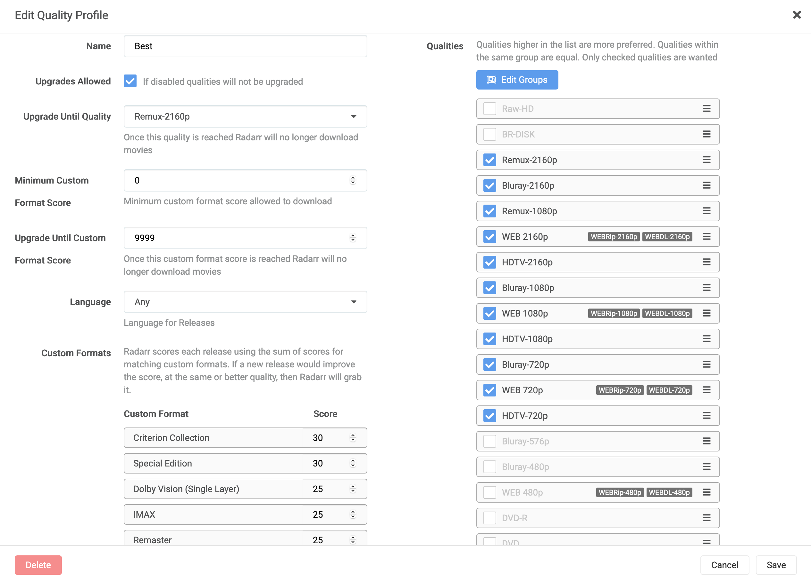

# Radarr

[Radarr](https://wiki.servarr.com/Radarr) is a movie manager that can grab movies using torrents.

## Compose

```
  radarr:
    image: ghcr.io/linuxserver/radarr
    container_name: radarr
    restart: unless-stopped
    volumes:
      - /configs/radarr:/config
      - /HDD1/Media:/media
```

I'm using [linuxserver.io's image](https://docs.linuxserver.io/images/docker-radarr)

## Tips

### Import existing library

I you already have a library but want to tidy it up you can follow these steps:

- Library Import
- Add you library
- Match you movies
- Go to the movie list and click "edit movies"
- Select everything
- Change root folder (even if they already are in this folder)
- Rename

### Settings

#### Media management

Enable "Import Extra Files" and set the value to `srt,nfo,sub` to import subtitle and `nfo` files

#### Profiles

I like to create a `Best` profile that will only take movies in quality >= 720p and keep upgrading until it's a 4k remux

1080p Remuxes are better than 2160p Web-DL (especially with the Shield's AI upscaling) so don't forget to change the order.

#### Custom Format

I highly suggest you take a look at [TRaSH's Guide's Custom Formats](https://trash-guides.info/Radarr/V3/Radarr-collection-of-custom-formats/) and add the one you want.



And don't forget to add them to your profiles



#### Indexers

Don't bother with Radarr's built in indexers support, use jackett for everything. It has better search and rss support and get updated more often.

You can add some restrictions to your releases. On my setup I restrict anything containing `XXX` or `Porn` to be sure to never get adult parody of my movies. This could cause some issue with some movies containing those terms through.

#### Connect

It might look dumb to enable connect at first since Plex automatically scan new files. But if you've got a upgrade Plex will only scan the movie if the name changes, it's always better to have it enabled.

#### General

Don't forget to enable security and disable analytics.